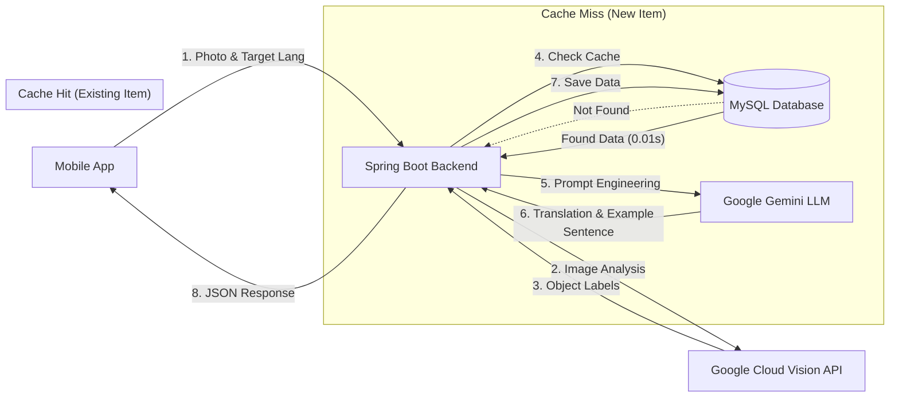

# 🍎 What's in My Refrigerator? - AI Language Learning App

> **A context-aware language learning application that turns everyday objects into micro-learning opportunities.**

This project transforms your refrigerator inventory into personalized language learning content. By leveraging **Computer Vision** to identify objects and **Generative AI (LLM)** to create context-specific sentences, it bridges the gap between the physical world and language education.

It features an **On-demand Caching System** to optimize performance, reduce latency, and minimize API costs.

---

## 🏗️ System Architecture

The core strength of this project is its **Hybrid AI Architecture** combined with a smart caching strategy.


## 🔑 Key Technical Features

- **Visual Recognition**: Uses Google Cloud Vision API to detect objects from raw camera images (e.g., identifying "Apple" from a photo).

- **Generative AI Integration**: Uses Google Gemini (LLM) to dynamically generate translations and context-appropriate example sentences (A1 level) for any detected object.

- **On-demand Caching Strategy**: Implements a "Check-DB-First" logic.
  - **Cache Miss**: Calls the expensive LLM API only when a new word is encountered, then saves the result.
  - **Cache Hit**: Returns data immediately from MySQL for previously scanned items, ensuring low latency and cost efficiency.

- **Text-to-Speech (TTS)**: Integrated audio playback for pronunciation practice using expo-speech.

- **Smart Filtering**: Post-processing logic to filter out generic labels (e.g., "Food", "Produce") and electronic devices to focus on specific ingredients.

---

## 🛠️ Technology Stack

### Frontend (Mobile)
- **Framework**: React Native (Expo)
- **Language**: TypeScript / JavaScript
- **Network**: Axios
- **Features**: Expo Camera, Expo Speech (TTS)

### Backend (Server)
- **Framework**: Spring Boot 3.2.0
- **Language**: Java 17
- **Database**: MySQL (JPA/Hibernate)
- **Build Tool**: Gradle
- **AI Clients**: Google Cloud Vision SDK, Spring REST Client (for Gemini)

### AI & Cloud Services
- **Google Cloud Vision API**: Object detection / Labeling.
- **Google Gemini API**: LLM for translation and natural language generation.

---

## 🚀 Getting Started

### 1. Prerequisites
- Node.js & npm
- Java JDK 17
- MySQL Server
- Google Cloud Platform Account (with Vision API enabled)
- Google AI Studio API Key (for Gemini)

### 2. Database Setup
Create a local MySQL database:
```sql
CREATE DATABASE my_fridge_db;
```

### 3. Backend Setup
Navigate to the backend directory:
```bash
cd backend
```

Add your GCP Service Account Key (`gcp-key.json`) to `src/main/resources/`.

Configure `src/main/resources/application.properties`:
```properties
# MySQL Configuration
spring.datasource.url=jdbc:mysql://localhost:3306/my_fridge_db?serverTimezone=UTC&characterEncoding=UTF-8
spring.datasource.username=root
spring.datasource.password=YOUR_DB_PASSWORD
spring.datasource.driver-class-name=com.mysql.cj.jdbc.Driver

# JPA Configuration
spring.jpa.hibernate.ddl-auto=update
spring.jpa.show-sql=true
spring.jpa.database-platform=org.hibernate.dialect.MySQL8Dialect

# Google Cloud Vision
spring.cloud.gcp.credentials.location=classpath:gcp-key.json

# Google Gemini
gemini.api.key=YOUR_GEMINI_API_KEY
gemini.api.url=https://generativelanguage.googleapis.com/v1beta/models/gemini-flash-latest:generateContent
```

Run the server:
```bash
./gradlew bootRun
```

### 4. Frontend Setup
Navigate to the frontend directory:
```bash
cd frontend
```

Install dependencies:
```bash
npm install
```

Update the API URL in `app/(tabs)/index.tsx`:
```javascript
// ⚠️ Replace with your computer's local IP address (e.g., 192.168.x.x)
// Do NOT use 'localhost' if testing on a real device.
const BACKEND_URL = 'http://YOUR_LOCAL_IP:8080/api/quiz/generate';
```

Run the app:
```bash
npx expo start
```

---

## 📱 Usage

1. **Select Language**: Choose your target language (Spanish, French, German, Korean, etc.) on the home screen.

2. **Snap**: Take a photo of an ingredient in your fridge (e.g., an apple, milk carton).

3. **Learn**: The app displays the detected word, its translation, and a generated example sentence.

4. **Listen**: Tap the speaker icon (🔊) or the sentence to hear the pronunciation.

---

## 🔮 Future Improvements

- **Semantic Filtering**: Implementing an LLM-based agent to intelligently select the most relevant food item from Vision API labels, replacing hardcoded blocklists.

- **Context-Awareness**: Using previous scan history to generate complex sentences that combine multiple ingredients (e.g., "I eat eggs with milk").

- **User Personalization**: Saving personal vocabulary lists and learning progress.

---

## 📄 License

This project is licensed under the MIT License.
